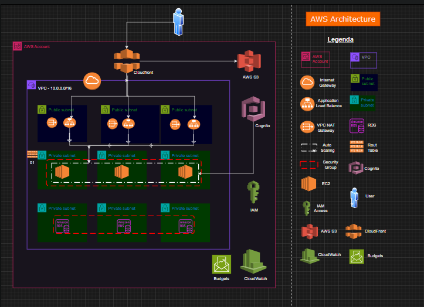

# Projeto Final Ada -  AWS Architecture

## Arquitetura do Projeto

### Green Books - E-commerce de Produtos Digitais
Este projeto simula a arquitetura de um e-commerce de produtos digitais, a Green Books, que vende e-books e cursos online. A infraestrutura foi configurada utilizando os serviços da AWS, com foco em escalabilidade, segurança e gerenciamento de custos.

Descrição do Cenário
Imagine que você está revisando a arquitetura de um site de e-commerce que vende produtos digitais, como e-books e cursos online. O sistema foi projetado para escalar automaticamente durante períodos de alta demanda, como campanhas de marketing e datas promocionais.

Arquitetura do Sistema
   A arquitetura do sistema foi dividida em várias camadas:

Frontend:

   Amazon S3: Armazenamento dos arquivos estáticos do site (HTML, CSS, JS).
   Amazon CloudFront: CDN para entrega eficiente de conteúdo.
   Backend:

Amazon EC2: Instâncias para hospedar a API que gerencia pedidos e login de usuários.
   Banco de Dados:

   Amazon RDS (MySQL): Banco de dados configurado em uma VPC com backups automáticos diários.
   Armazenamento de Produtos:

Amazon S3: Armazenamento dos arquivos digitais (e-books, cursos).
   Segurança:

AWS IAM: Gerenciamento de permissões para garantir que apenas administradores tenham acesso ao backend.
   Monitoramento:

Amazon CloudWatch: Monitoramento do desempenho das instâncias EC2 e envio de alarmes para a equipe técnica.
   Gerenciamento de Custos:

AWS Budgets: Alertas configurados para notificar se os custos mensais ultrapassarem o limite definido.
   Arquitetura de Alta Disponibilidade

Para garantir a resiliência do sistema, a arquitetura foi projetada para se adaptar automaticamente a picos de tráfego e falhas em componentes. A infraestrutura foi implementada de forma a garantir a alta disponibilidade e a recuperação rápida em caso de falhas.

A arquitetura foi desenhada no draw.io e os componentes estão sendo provisionados e gerenciados utilizando Terraform.

Tecnologias Utilizadas
- AWS (Amazon Web Services)
- Terraform (para provisionamento de infraestrutura como código)
- Amazon S3, CloudFront, EC2, RDS, IAM, CloudWatch, Budgets
- MySQL (banco de dados relacional)
- Draw.io (para desenhar a arquitetura)

## Como Configurar o Ambiente

### Pré-requisitos

Conta na AWS: Você precisa de uma conta AWS configurada para usar os serviços necessários.
Terraform instalado: O Terraform será utilizado para provisionar a infraestrutura.
AWS CLI configurada: Certifique-se de que o AWS CLI esteja configurado em seu ambiente local.
Instalação do Git
Se você ainda não tem o Git instalado, siga os passos abaixo:

1. Para Windows:

Acesse [Git for Windows](https://gitforwindows.org/) e siga as instruções de instalação.

2. Para macOS:

Utilize o Homebrew: 
``brew install git``

3. Para Linux:

Em distribuições baseadas no Ubuntu/Debian
`` sudo apt update``
``sudo apt install git``

Para obter o código do projeto no seu computador, siga os seguintes passos:

1.  Abra o terminal ou o prompt de comando.
   
2. Clone o repositório com o seguinte comando

``git clone https://github.com/seu-usuario/green-books.git``

### Configurando a Infraestrutura

1. Navegue até o diretório do projeto:cd green-books

``cd green-books``

2. Certifique-se de que o Terraform está instalado e configurado.

3. Inicialize o Terraform:

``terraform init``

4. Revise os planos de execução:
`` terraform plan``

5. Aplique o plano para provisionar a infraestrutura:
``terraform apply``

6. Após a execução, você terá todos os componentes da AWS provisionados e prontos para uso.

## Enviando o Projeto para o GitHub
Se você fez alterações no projeto e quer enviá-las para o repositório remoto no GitHub, siga os passos abaixo:

1. Adicione os arquivos ao repositório local:
``git add .``

2. Faça um commit das mudanças:
``git commit -m "Descrição das mudanças realizadas"``

3. Envie as alterações para o GitHub:
``git push origin main``

# Arquitetura da Solução
A arquitetura foi desenhada usando a ferramenta draw.io e inclui todos os componentes mencionados anteriormente, como S3, EC2, RDS, CloudFront, entre outros. Abaixo está a arquitetura desenhada no draw.io:

## Contribuindo para o Projeto
Se você deseja contribuir para este projeto, siga os passos abaixo:

1.  Faça um fork do repositório.

2.  Crie uma nova branch para suas modificações:
``git checkout -b nome-da-branch``

3. Faça suas alterações e adicione um commit.
``git push origin nome-da-branch``

4. Envie suas alterações para o seu fork:
``git push origin nome-da-branch``

5. Abra um Pull Request (PR) para o repositório principal.

## Licença
Este projeto está licenciado sob a MIT License.

# Autores:
-[Michelle Sindeaux](https://github.com/michelle-sstudart)
